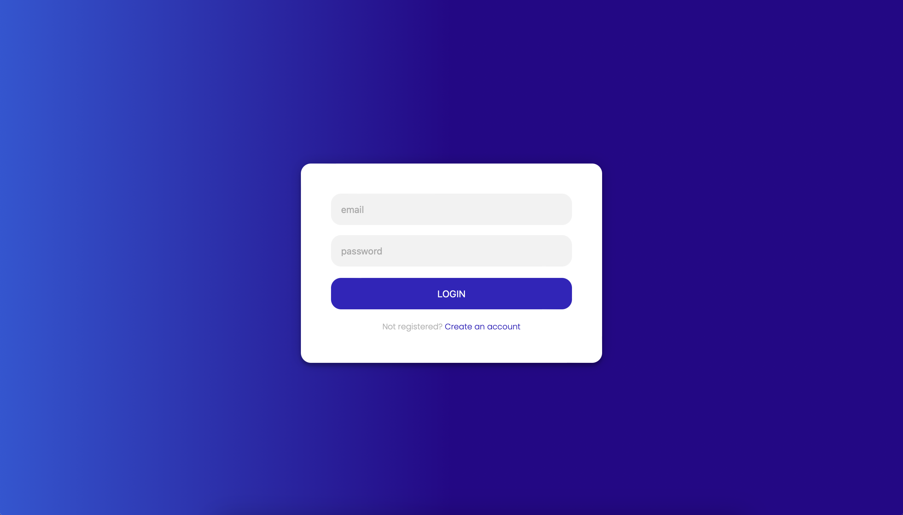
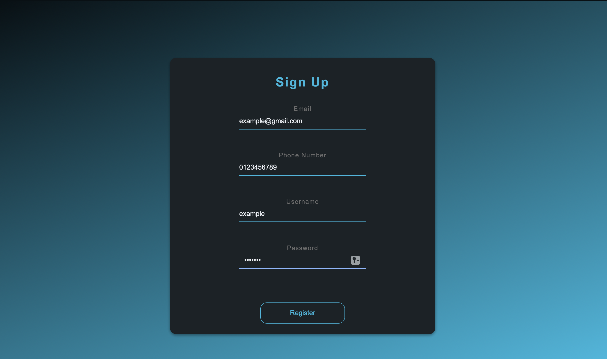
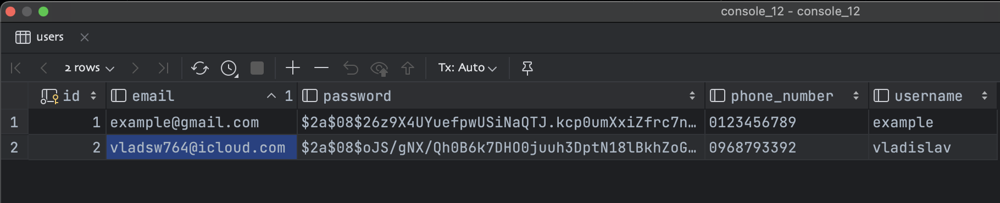

# CRUD-project 
### Used technologies:

#### Spring Boot, Spring MVC, Spring Security, Lombok, HTML, CSS, Bootstrap, Spring Data JPA, Postgre SQL

_At last changes was added security. So for user without registration available only Main Page And Shop. Guest can not see Blog Section, More info about products in Shop Section and can't add new product._
_In database we can't see password of users, because it was encrypted._


### Database configuration:
#### Connect local database in (application.yaml) file"
```agsl
server:
  port: 8888
spring:
  datasource:
    //Here you write your url for DB connection instead of mine
    url: jdbc:postgresql://localhost:5432/blog_db
    //Your username
    username: postgres
    //Your password
    password: postgres
  jpa:
    hibernate:
      ddl-auto: update
    show-sql: true
    properties:
      hibernate:
        format_sql: true
        dialect: org.hibernate.dialect.PostgreSQLDialect
  mvc:
    hiddenmethod:
      filter:
        enabled: true
```

Below you can view screenshots of the website⬇️


Button View and Edit also work in main page.

Main page:

Blog page:

Create new blog page:

More info:

Edit post:

Login page:

Registration page:

Data which have been saved in database:

