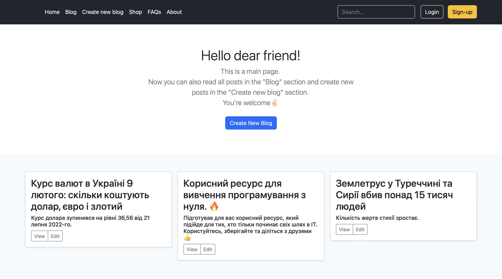
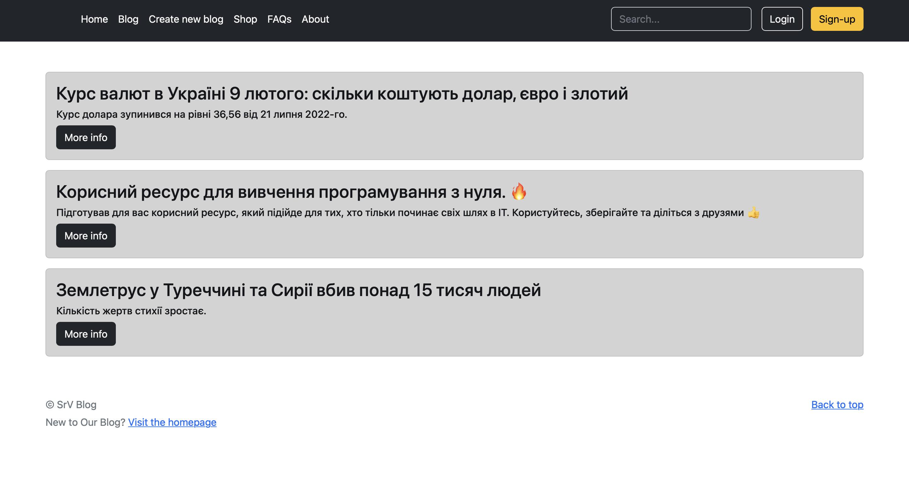
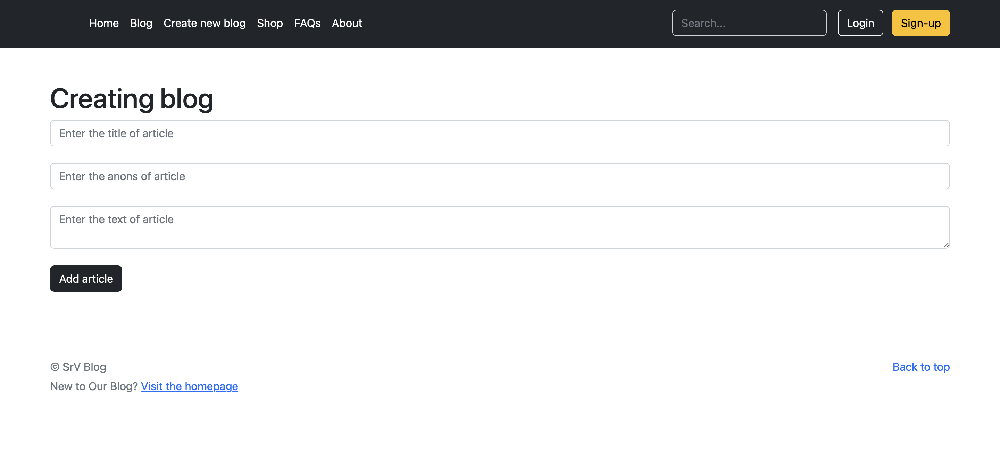
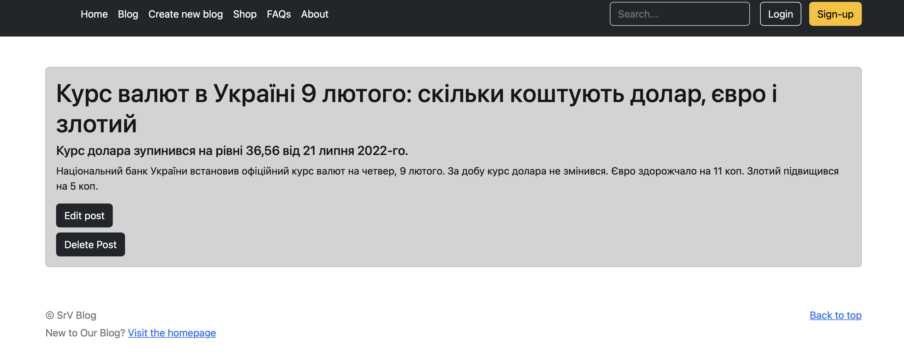
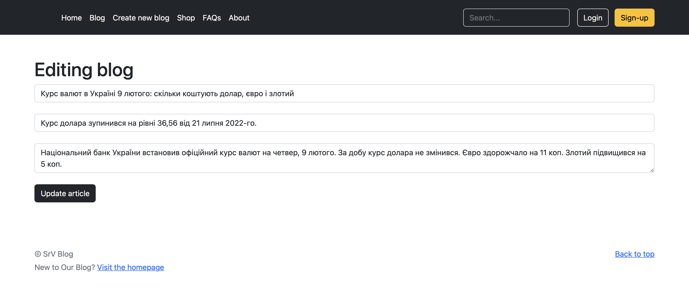

# CRUD-project 
### Used technologies:

#### Spring Boot, Spring MVC, HTML, CSS, Bootstrap, Spring Data JPA, Postgre SQL


### Database configuration:
#### Connect local database in (application.yaml) file"
```agsl
server:
    port: 8888
spring:
  datasource:
    url: [Your url connection to database]
    username: [Your username]
    password: [Your password]
  jpa:
    hibernate:
      ddl-auto: update
    show-sql: true
    properties:
      hibernate:
        format_sql: true
        dialect: org.hibernate.dialect.PostgreSQLDialect
```
Below you can view screenshots of the website⬇️

Button View and Edit also work in main page.

Main page:

Blog page:

Create new blog page:

More info:

Edit post:
